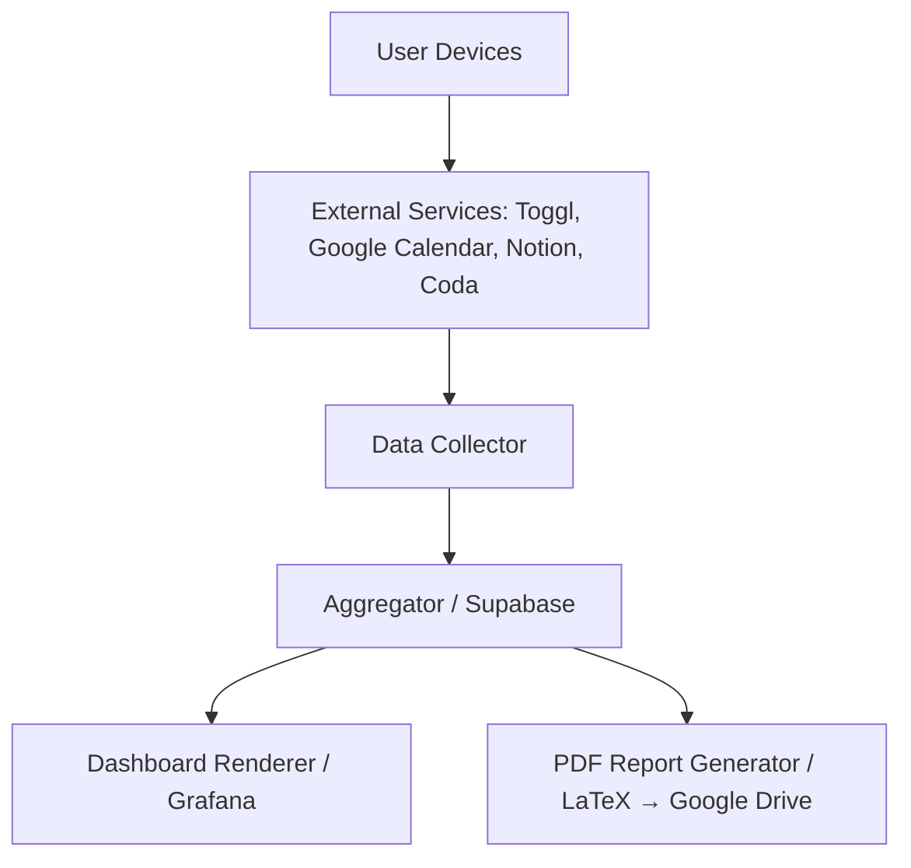
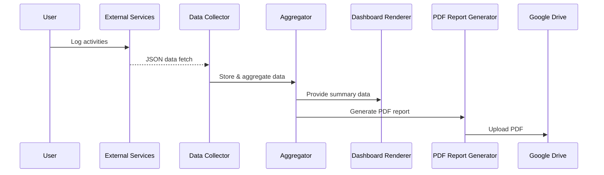
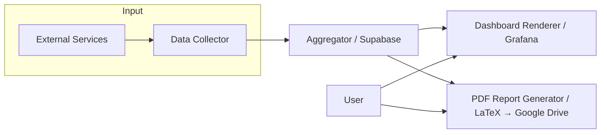

# High-Level Design (HLD) – LIFE TRACER
*Version 0.1.0 – Draft*

---

## 1. Introduction

### 1.1 Purpose
This document provides the high-level design for the LIFE TRACER system. It translates the system requirements specified in the SRS into a structured architectural design, describing components, data flow, and interfaces, serving as a guide for detailed design and implementation.

### 1.2 Scope
The scope of this document covers:
- Architectural overview of LIFE TRACER
- Component responsibilities and interactions
- Data flow between modules and external services
- Security and design constraints
- Traceability to SRS requirements

### 1.3 References
- LIFE TRACER RDD v0.1.0 – Draft
- LIFE TRACER SRS v0.1.0 – Draft
- ISO/IEC/IEEE 29148:2018 – Systems and software engineering — Life cycle processes — Requirements engineering

---

## 2. System Overview

LIFE TRACER is a personal self-tracking tool that collects activity data from third-party services, aggregates the data, visualizes insights, and generates PDF reports.

### 2.1 High-Level Architecture Diagram (Mermaid)

### 2.2 Major Components
| Component                  | Responsibility                                                                 |
| -------------------------- | ----------------------------------------------------------------------------- |
| Data Collector             | Retrieve JSON data from external services via APIs (OAuth2/API key)           |
| Aggregator                 | Aggregate raw activity logs in Supabase, generate summary data                |
| Dashboard Renderer         | Provide visual summaries via Grafana dashboards                               |
| PDF Report Generator       | Compile LaTeX templates in cloud and upload PDF reports to Google Drive       |
| Authentication Manager     | Manage OAuth2 or API key credentials for external services                    |
| Scheduler                  | Automate data collection, aggregation, and report generation                 |

---

## 3. Design Considerations

- **Non-functional Requirements**: Performance (aggregation within 30 sec), responsiveness, and security (HTTPS mandatory) must be respected.
- **Single-user scope**: No multi-user features; personal account data only.
- **External dependencies**: System relies on external services (Toggl, Google Calendar, Notion, Coda, Supabase, Grafana) and their availability.
- **Security**: All API communication via HTTPS; user data stored in Supabase; PDF reports private on Google Drive.

---

## 4. Architectural Design

### 4.1 Component Interaction (Mermaid Sequence Diagram)

### 4.2 Data Flow Diagram (Mermaid)

### 4.3 Data Structures
- **project_group**: { project, group_color }
- **project**: { name, color, active, status }
- **time_entry**: { start, end, duration, project, tag, description, memo }
- **plan_entry**: { start, end, duration, project, tag, description }

---

## 5. Component Design

### 5.1 Data Collector
- Responsibilities: API requests, JSON parsing, error handling
- Inputs: User credentials (OAuth2/API key)
- Outputs: Raw activity logs
- Constraints: Must respect rate limits of external services

### 5.2 Aggregator
- Responsibilities: Data aggregation, summary computation, storage in Supabase
- Inputs: Raw activity logs
- Outputs: Aggregated summaries for dashboards and reports
- Constraints: Aggregation updates reflected within 30 seconds

### 5.3 Dashboard Renderer
- Responsibilities: Display visual summaries in Grafana dashboards
- Inputs: Aggregated data from Supabase
- Outputs: Interactive dashboards
- Constraints: Responsive on desktop and mobile

### 5.4 PDF Report Generator
- Responsibilities: Compile LaTeX templates in cloud, generate PDF, upload to Google Drive
- Inputs: Aggregated data
- Outputs: PDF report
- Constraints: Privacy and access control must ensure user-only access

### 5.5 Authentication Manager
- Responsibilities: OAuth2 or API key management, token refresh
- Inputs: User credentials
- Outputs: Authenticated API sessions
- Constraints: No custom account system; single-user scope

### 5.6 Scheduler
- Responsibilities: Automate periodic tasks (data fetch, aggregation, report generation)
- Inputs: Time schedule configuration
- Outputs: Triggered component actions
- Constraints: Reliable scheduling, error logging optional

---

## 6. External Interface Design

### 6.1 User Interfaces
- Data entry: Toggl, Google Calendar, Notion, Coda
- Visualization: Grafana dashboards
- PDF report access: Google Drive

### 6.2 APIs / External Services
- Toggl Track, Google Calendar, Supabase, Grafana Cloud, Notion, Coda
- Authentication via OAuth2 or API keys
- Communication via HTTPS

### 6.3 Data Interfaces
- JSON over HTTPS for data retrieval
- Internal data model as specified in Section 4.3

### 6.4 Hardware Interfaces
- User devices: PC, smartphone, wearables (no device-specific dependency)

---

## 7. Security Considerations

- API communication must use HTTPS
- Supabase handles at-rest encryption
- Single-user scope; multi-user features are out of scope
- PDF reports private in Google Drive
- Optional logging for auditing

---

## 8. Traceability Matrix

| Requirement ID | Linked SRS Component / Module                 |
| -------------- | -------------------------------------------- |
| FR-001         | Data Collector                               |
| FR-002         | Aggregator                                   |
| FR-003         | Dashboard Renderer                            |
| FR-004         | PDF Report Generator                          |
| NFR-001        | Aggregator / Scheduler                        |
| NFR-002        | Dashboard Renderer                             |
| NFR-003        | Authentication Manager / API communication    |

---

## 9. Assumptions and Limitations

- Single-user setup only
- No custom backend beyond Supabase
- Relies on free-tier or limited APIs of external services
- Initial release focuses on MVP functionality

---

## 10. Appendix
- Sample ER diagram (optional)
- Example JSON data structure
- Future extension notes: multi-user support, additional visualization types
