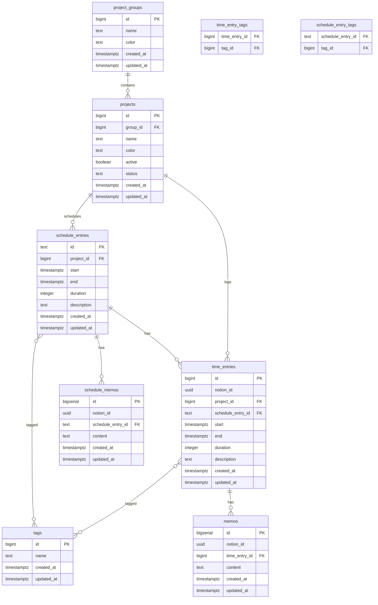

# Database Schema Design – LIFE TRACER
*Version 0.1.0 – Draft*

---

## 1. Purpose
This document defines the database schema for LIFE TRACER, implemented on Supabase (PostgreSQL).  
The schema supports collection, aggregation, visualization, and reporting of user activity data.

---

## 2. Design Principles
- **Normalization**: Avoid data redundancy, use foreign keys.
- **Traceability**: Ensure each activity and plan entry is uniquely identifiable.
- **Extensibility**: Allow new external services or categories without major schema changes.
- **Auditability**: All tables include `created_at`, `updated_at`, and `id` fields.

---

## 3. Entity-Relationship Overview



---

## 4. Table Definitions

### 4.1 `project_group`
- **Purpose**: Categorize projects into higher-level groups.
- **Fields**:
  - `id uuid PK`
  - `name text NOT NULL`
  - `color text`
  - `created_at timestamp DEFAULT now()`
  - `updated_at timestamp DEFAULT now()`

### 4.2 `project`
- **Purpose**: Represents a tracked project or activity domain.
- **Fields**:
  - `id uuid PK`
  - `group_id uuid FK → project_group.id`
  - `name text NOT NULL`
  - `color text`
  - `active boolean DEFAULT true`
  - `status text` (e.g., planned, ongoing, archived)
  - `created_at timestamp DEFAULT now()`
  - `updated_at timestamp DEFAULT now()`

### 4.3 `tag`
- **Purpose**: User-defined labels to categorize activities.
- **Fields**:
  - `id uuid PK`
  - `name text NOT NULL`
  - `color text`
  - `created_at timestamp DEFAULT now()`
  - `updated_at timestamp DEFAULT now()`

### 4.4 `time_entry`
- **Purpose**: Actual logged activities.
- **Fields**:
  - `id uuid PK`
  - `project_id uuid FK → project.id`
  - `start timestamp NOT NULL`
  - `end timestamp NOT NULL`
  - `duration_minutes int NOT NULL`
  - `description text`
  - `created_at timestamp DEFAULT now()`
  - `updated_at timestamp DEFAULT now()`

### 4.5 `plan_entry`
- **Purpose**: Planned (scheduled) activities.
- **Fields**:
  - `id uuid PK`
  - `project_id uuid FK → project.id`
  - `start timestamp NOT NULL`
  - `end timestamp NOT NULL`
  - `duration_minutes int NOT NULL`
  - `description text`
  - `created_at timestamp DEFAULT now()`
  - `updated_at timestamp DEFAULT now()`

### 4.6 `memo`
- **Purpose**: Free-form notes attached to `time_entry`.
- **Fields**:
  - `id uuid PK`
  - `time_entry_id uuid FK → time_entry.id`
  - `content text NOT NULL`
  - `created_at timestamp DEFAULT now()`
  - `updated_at timestamp DEFAULT now()`

---

## 5. Indexing and Performance

- `project.name` (b-tree) for quick lookup
- `time_entry.start`, `time_entry.end` (b-tree) for time-range queries
- `plan_entry.start`, `plan_entry.end` (b-tree) for schedule queries
- `tag.name` (unique index)
- Foreign keys enforce referential integrity

---

## 6. Example Queries

### Retrieve all activities in a date range:
```sql
SELECT t.id, p.name, t.start, t.end, t.duration_minutes
FROM time_entry t
JOIN project p ON t.project_id = p.id
WHERE t.start >= '2025-01-01' AND t.end < '2025-02-01';
```

### Summarize time by project group:
```sql
SELECT pg.name AS group_name, SUM(t.duration_minutes) AS total_minutes
FROM time_entry t
JOIN project p ON t.project_id = p.id
JOIN project_group pg ON p.group_id = pg.id
GROUP BY pg.name;
```

---

## 7. Traceability
- Supports **FR-001** (Record daily activities)
- Supports **FR-002** (Aggregate logged data)
- Supports **FR-003** (Provide dashboards)
- Supports **FR-004** (Export PDF reports)

---
